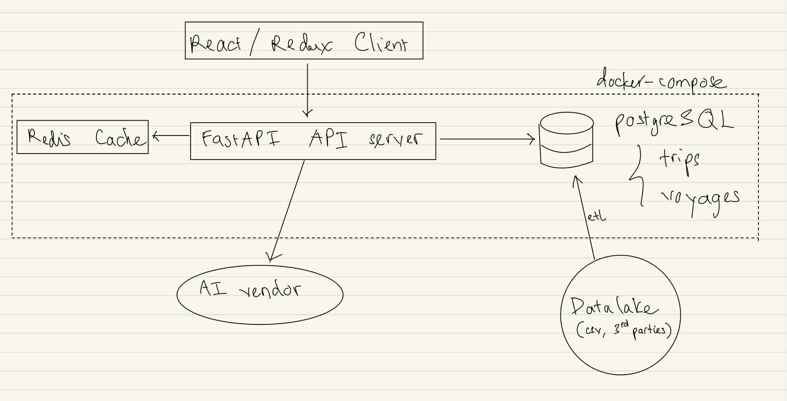

# Planning Document

## 1. Requirements

### Functional:

- Query capacity per TEU as 4-week rolling average for the corridor
  - Extension:
    - Ability to query `n-week` rolling avergage, not just 4
    - Ability to query from any corridors, not just China - North EU

### Non-funtional:

- Relax consistency, eventual consistency is good enough for this use case, since the read/write ratio is expected to be >> 1 (much larger than 1).
  => Build AP System (Availability and Partition Tolerance)

## 2. Access Patterns & Storage:

### Entities:

Identify entities which will be used to for storage and access patterns

- Trip: one row in the raw data,
- Voyage: uniquely identified using composition of 3 columns from trips
- Relationships between trip-voyage: one-to-many relationship, a voyage consists of multiple trips, each trip belongs to one voyage

### Access Patterns:

- Query capacity by date range
  - Input: date_from, date_to (date strings),
  - Output: List of weeks with rolling average capacity
  - Frequency: High (1000+ requests/day)
  - Latency requirement: < 100ms
- Query capacity by corridor (extension)
  - Input: corridor (e.g., 'china_main-north_europe_main'), date_from, date_to
  - Output: List of weeks with rolling average capacity for that corridor
  - Frequency: Medium
  - Latency requirement: < 100ms
- Query with variable rolling window (extension)
  - Input: n_weeks (e.g., 4, 8, 12), date_from, date_to
  - Output: List of weeks with n-week rolling average
  - Frequency: Low
  - Latency requirement: < 200ms

### Storage:

**Raw Data (File System / S3):**

- **`sailing_level_raw.csv`**
  - Source data from 3rd parties / data lake
  - ~4,000+ rows per file
  - Stored in S3 or local filesystem
  - Retention: Indefinite (for replay/audit)
  - Format: CSV with headers

**Database: PostgreSQL (Relational/Structured)**

- **`trips`**
  - Cleaned port-to-port movements loaded from CSV
  - Foreign key to `voyages.id`
  - ~4,000+ rows
  - Write-heavy during ETL, read-light

- **`voyages`**
  - Unique vessel journeys with pre-computed week assignment
  - ~473 rows initially
  - Read-heavy from API queries
  - Unique constraint on 3-column composite key

## 3. Concrete API and Storage Designs:

### API Design

**Endpoints:**

- `GET /capacity` - Query capacity with rolling average for date range
   - Params: date_from, date_to, corridor (optional), n_weeks (optional)
   - Returns: List of weeks with rolling average capacity

- `GET /health` - Health check
   - Returns: Service status, last ETL run timestamp

### Storage Design

**Tables:**

- **trips**
   - Purpose: Store individual port-to-port movements
   - Key columns: id, voyage_id (FK), origin, origin_port_code, destination_port_code, origin_at_utc, offered_capacity_teu
   - Indexes: voyage_id, origin
   - Size: ~4,000+ rows

- **voyages**
   - Purpose: Deduplicated vessel journeys with week assignment
   - Key columns: id, service_version_roundtrip, origin_service_master, dest_service_master, corridor, latest_origin_departure, week_start_date, week_no, capacity_teu
   - Unique constraint: (service_version_roundtrip, origin_service_master, dest_service_master)
   - Indexes: week_start_date, corridor, (corridor, week_start_date)
   - Size: ~473 rows

- **weekly_capacity_rolling** (Materialized View)
   - Purpose: Pre-computed weekly totals with common rolling averages (4-week, 8-week)
   - Key columns: corridor, week_start_date, week_no, total_capacity_teu, offered_capacity_teu_4week, offered_capacity_teu_8week
   - Unique index: (corridor, week_start_date, week_no) - required for concurrent refresh
   - Refreshed: After each ETL run using CONCURRENT mode (non-blocking)

**Cache:**
- Redis key: `capacity:rolling_avg:{corridor}:{n_weeks}`
- Invalidation: On ETL completion

## 4. Architecture Overview

## Components

### 1. Frontend

- **Technology**: React with Redux
- **Purpose**: User interface for querying capacity data and visualizing trends
- **Key Features**: Date range picker, corridor selector, rolling window selector, natural language query input
- **Notes**: Communicates with API layer only, no direct database access

### 2. API Layer

- **Technology**: Python
- **Framework**: FastAPI
- **Endpoints**: See API Design section (GET /capacity, POST /query, GET /health)
- **Responsibilities**: Request validation, cache management, database queries, response formatting
- **Notes**: Stateless, horizontally scalable

### 3. Cache Layer

- **Technology**: Redis
- **Strategy**: Cache entire rolling average dataset per corridor/n_weeks combination
- **Key Pattern**: `capacity:rolling_avg:{corridor}:{n_weeks}`
- **Invalidation**: Clear all `capacity:*` keys on ETL completion
- **TTL**: No expiration, manual invalidation only
- **Notes**: Reduces database load, ~10ms response time on cache hit

### 4. Database

- **Technology**: PostgreSQL 15+
- **Tables**:
  - `trips`: Raw port-to-port movements (~4k rows)
  - `voyages`: Deduplicated journeys with week assignment (~473 rows)
- **Views/Indexes**:
  - Materialized view: `weekly_capacity_rolling` (pre-computed rolling averages)
  - Indexes: voyages(week_start_date), voyages(corridor), voyages(corridor, week_start_date), trips(voyage_id)
- **Notes**: Single instance for MVP, read replicas for scale

### 5. ETL Process

- **Trigger**: Manual execution of `python etl/seed.py`
- **Frequency**: On-demand (when new CSV data is available)
- **Steps**:
  1. Extract: Read CSV from S3/filesystem
  2. Transform: Deduplicate edges → voyages, compute week assignments
  3. Load: Upsert trips + voyages tables (via VoyageDataService)
  4. Refresh: Rebuild materialized view
  5. Invalidate: Clear Redis cache
- **Technology**: Python script (standalone CLI, not part of API)
- **Notes**: Runs independently of API server, atomic transactions per voyage

### 6. External Services

- **Data Lake**: S3 (or local filesystem for development)
  - Purpose: Store raw CSV files from 3rd parties
  - Access: ETL process reads from here

- **Notes**: Data lake can be local files for MVP

## Data Flow

### Read Path (User Query)

1. User sends `GET /capacity?date_from=2024-01-01&date_to=2024-03-31&corridor=china_main-north_europe_main&n_weeks=4`
2. FastAPI validates parameters (date format, corridor exists)
3. Check Redis cache with key `capacity:rolling_avg:china_main-north_europe_main:4`
4. **[Cache Hit]** Return cached data, filter by date range in-memory → Response (~10ms)
5. **[Cache Miss]** Query `weekly_capacity_rolling` materialized view → Filter by corridor, date range → Cache result → Response (~50-100ms)

### Write Path (ETL)

1. Admin runs `python etl/run_etl.py` manually when new CSV data is available
2. Extract: Read `sailing_level_raw.csv` from S3/filesystem
3. Transform: For each row, call `VoyageService.add_trip()` which atomically:
   - Inserts into `trips` table
   - Upserts into `voyages` table (updates if newer departure timestamp)
4. Refresh: Execute `REFRESH MATERIALIZED VIEW CONCURRENTLY weekly_capacity_rolling` (non-blocking, view remains queryable)
5. Invalidate: Clear all Redis keys matching `capacity:*` (if using cache)
6. ETL complete (~2-5 minutes for 4k rows)
